# PartnerBet Pro V2 — ER Diagram (Phase 1)

```mermaid
erDiagram
    AUTH_USERS ||--|| PROFILES : "id"
    ROLES ||--o{ PROFILES : "role_id"
    ROLES ||--o{ ROLE_PERMISSIONS : "role_id"
    PERMISSIONS ||--o{ ROLE_PERMISSIONS : "permission_id"

    PROFILES ||--o{ POSTS : "author_id"
    PROFILES ||--o{ FOOTBALL_NEWS : "author_id"
    PROFILES ||--o{ MATCH_INSIGHTS : "created_by / updated_by"
    PROFILES ||--o{ PROMOTIONS : "created_by"
    PROFILES ||--o{ APK_RELEASES : "created_by"
    PROFILES ||--o{ ADVERTISEMENTS : "created_by"
    PROFILES ||--o{ MEDIA : "uploaded_by"
    PROFILES ||--o{ SITE_SETTINGS : "updated_by"
    PROFILES ||--o{ SUPPORT_CONVERSATIONS : "assigned_admin_id"
    PROFILES ||--o{ AUDIT_LOGS : "actor_id"

    CATEGORIES ||--o{ CATEGORIES : "parent_id (self)"
    CATEGORIES ||--o{ POSTS : "category_id"
    CATEGORIES ||--o{ FOOTBALL_NEWS : "category_id"

    MEDIA ||--o{ POSTS : "cover_media_id"
    MEDIA ||--o{ FOOTBALL_NEWS : "cover_media_id"
    MEDIA ||--o{ ADVERTISEMENTS : "image_media_id"

    POSTS ||--o{ POST_TAGS : "post_id"
    TAGS ||--o{ POST_TAGS : "tag_id"

    NAVIGATION_ITEMS ||--o{ NAVIGATION_ITEMS : "parent_id (self)"

    SUPPORT_CONVERSATIONS ||--o{ SUPPORT_MESSAGES : "conversation_id"

    PROFILES {
        uuid id PK "= auth.users.id"
        uuid role_id FK
        text full_name
        boolean is_active
        timestamptz created_at
    }
    ROLES {
        uuid id PK
        text key "super_admin/admin/editor/user"
        text name
    }
    PERMISSIONS {
        uuid id PK
        text key "e.g. posts.manage"
    }
    ROLE_PERMISSIONS {
        uuid role_id PK,FK
        uuid permission_id PK,FK
    }
    POSTS {
        uuid id PK
        text title
        text slug UK
        uuid category_id FK
        uuid cover_media_id FK
        uuid author_id FK
        text status "draft/scheduled/published/archived"
        timestamptz deleted_at "soft delete"
    }
    FOOTBALL_NEWS {
        uuid id PK
        text title
        text slug UK
        text league
        text status
        timestamptz deleted_at
    }
    MATCH_INSIGHTS {
        uuid id PK
        text league
        text home_team
        text away_team
        timestamptz match_time
        smallint confidence
        text status
        timestamptz deleted_at
    }
    CATEGORIES {
        uuid id PK
        text slug
        text content_type "post/football_news"
        uuid parent_id FK
    }
    TAGS {
        uuid id PK
        text name UK
    }
    POST_TAGS {
        uuid post_id PK,FK
        uuid tag_id PK,FK
    }
    MEDIA {
        uuid id PK
        text storage_path
        text public_url
        timestamptz deleted_at
    }
    PROMOTIONS {
        uuid id PK
        text code UK
        boolean is_active
        timestamptz deleted_at
    }
    APK_RELEASES {
        uuid id PK
        text version
        boolean is_active "only 1 true at a time (unique index)"
        timestamptz deleted_at
    }
    ADVERTISEMENTS {
        uuid id PK
        text kind "image/embed/banner"
        text placement
        boolean is_active
        timestamptz deleted_at
    }
    SITE_SETTINGS {
        uuid id PK
        text key UK
        jsonb value
    }
    NAVIGATION_ITEMS {
        uuid id PK
        text location "header/footer"
        uuid parent_id FK
        int position
    }
    FAQS {
        uuid id PK
        text question
        int position
    }
    SUPPORT_CONVERSATIONS {
        uuid id PK
        text status "open/resolved"
        uuid assigned_admin_id FK
    }
    SUPPORT_MESSAGES {
        uuid id PK
        uuid conversation_id FK
        text sender "visitor/admin"
    }
    ANALYTICS_EVENTS {
        uuid id PK
        text event_type
        jsonb meta
        timestamptz created_at "BRIN indexed"
    }
    AUDIT_LOGS {
        uuid id PK
        uuid actor_id FK
        text action "INSERT/UPDATE/DELETE"
        text table_name
        jsonb old_data
        jsonb new_data
    }
```

## Jadval guruhlari

| Guruh | Jadvallar |
|---|---|
| **Kirish / rollar** | `roles`, `permissions`, `role_permissions`, `profiles` |
| **Kontent** | `posts`, `post_tags`, `football_news`, `match_insights`, `categories`, `tags` |
| **Tijorat** | `promotions`, `apk_releases`, `advertisements` |
| **Sayt qurilishi** | `site_settings`, `navigation_items`, `faqs`, `media` |
| **Muloqot** | `support_conversations`, `support_messages` |
| **Kuzatuv** | `analytics_events`, `audit_logs` |

Jami: **21 jadval**, 2 Storage bucket (`media`, `apk`).
